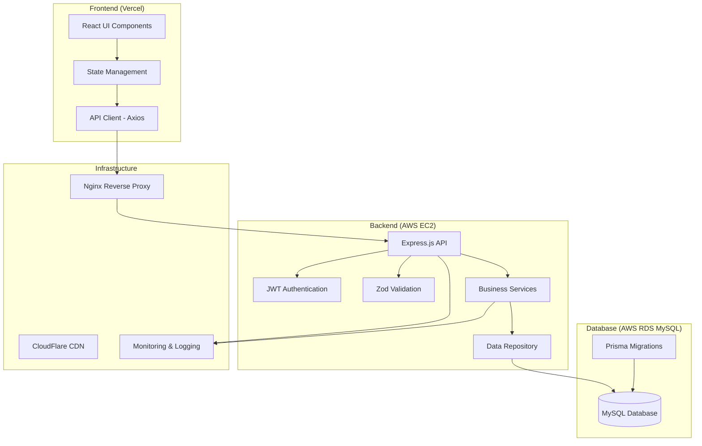

# PFM Architecture Implementation Plan

## 1. Architecture Overview

### High-Level Architecture Diagram



### Layered Structure Explanation

#### Frontend Layers
1. **Presentation Layer**: React components with TypeScript
2. **State Management Layer**: React Context + useReducer for global state, useState for local state
3. **Service Layer**: API client with Axios interceptors
4. **Validation Layer**: React Hook Form with client-side validation

#### Backend Layers
1. **Controller Layer**: Express.js route handlers
2. **Service Layer**: Business logic and financial calculations
3. **Repository Layer**: Data access with Prisma ORM
4. **Database Layer**: MySQL with proper indexing and constraints

### Rationale for Architectural Choices

#### Separation of Concerns
- **Frontend**: Focus on UI/UX and user interactions
- **Backend**: Handle business logic, data persistence, and security
- **Database**: Optimized for financial data integrity and performance

#### Technology Alignment
- **React + TypeScript**: Type safety and component reusability
- **Express.js + TypeScript**: Consistent type safety across stack
- **Prisma + MySQL**: Type-safe database access with proven reliability
- **JWT Authentication**: Stateless, scalable authentication
- **Zod Validation**: Runtime type validation matching TypeScript types

#### Security Considerations
- **JWT with HttpOnly cookies**: Prevent XSS token theft
- **bcrypt password hashing**: Industry-standard password security
- **Input validation**: Multiple layers of validation (client + server)
- **HTTPS everywhere**: Encrypted data transmission

#### Scalability Considerations
- **Stateless backend**: Easy horizontal scaling
- **Database connection pooling**: Efficient resource usage
- **CDN for static assets**: Reduced server load
- **Separate frontend/backend deployment**: Independent scaling

## 2. Technology Stack Justification

### Frontend Technologies

| Technology | Constitution Alignment | Purpose | Human Approval Needed |
|------------|----------------------|---------|---------------------|
| React 18+ | ✅ Specified in constitution | UI framework with component-based architecture | No |
| TypeScript | ✅ Specified in constitution | Type safety and better developer experience | No |
| Vite | ✅ Specified in constitution | Fast build tool and development server | No |
| React Context API | ✅ Specified in constitution | Global state management | No |
| useReducer | ✅ Specified in constitution | Complex state logic management | No |
| Axios | ✅ Specified in constitution | HTTP client with interceptors | No |
| React Hook Form | ✅ Specified in constitution | Form handling and validation | No |
| CSS Modules | ✅ Specified in constitution | Scoped styling solutions | No |

### Backend Technologies

| Technology | Constitution Alignment | Purpose | Human Approval Needed |
|------------|----------------------|---------|---------------------|
| Node.js 18+ | ✅ Specified in constitution | JavaScript runtime environment | No |
| Express.js | ✅ Specified in constitution | Web framework for API development | No |
| TypeScript | ✅ Specified in constitution | Type safety for backend code | No |
| Zod | ✅ Specified in constitution | Runtime validation and type inference | No |
| Prisma | ✅ Specified in constitution | Type-safe database ORM | No |
| bcrypt | ✅ Specified in constitution | Password hashing (12+ rounds) | No |
| JWT | ✅ Specified in constitution | Authentication tokens | No |
| Winston | ✅ Specified in constitution | Structured logging | No |
| dotenv | ✅ Specified in constitution | Environment variable management | No |

### Database Technologies

| Technology | Constitution Alignment | Purpose | Human Approval Needed |
|------------|----------------------|---------|---------------------|
| MySQL 8.0+ | ✅ Specified in constitution | Relational database for financial data | No |
| Prisma ORM | ✅ Specified in constitution | Type-safe database operations | No |

### Testing Technologies

| Technology | Constitution Alignment | Purpose | Human Approval Needed |
|------------|----------------------|---------|---------------------|
| Vitest | ✅ Specified in constitution | Unit and integration testing framework | No |
| Supertest | ✅ Specified in constitution | HTTP endpoint testing | No |
| Playwright | ✅ Specified in constitution | End-to-end testing | No |

### Deployment Technologies

| Technology | Constitution Alignment | Purpose | Human Approval Needed |
|------------|----------------------|---------|---------------------|
| Vercel | ✅ Specified in constitution | Frontend deployment platform | No |
| AWS EC2 | ✅ Specified in constitution | Backend server hosting | No |
| AWS RDS | ✅ Specified in constitution | Managed MySQL database | No |
| GitHub Actions | ✅ Specified in constitution | CI/CD pipeline | No |
| Nginx | ✅ Specified in constitution | Reverse proxy and load balancing | No |
| CloudFlare | ✅ Specified in constitution | CDN and DDoS protection | No |

### Additional Libraries Needed

| Technology | Purpose | Constitution Alignment | Human Approval Needed |
|------------|---------|----------------------|---------------------|
| @types/node | Node.js TypeScript definitions | ✅ Implied by TypeScript usage | No |
| jsonwebtoken | JWT token handling | ✅ Implied by JWT authentication | No |
| cookie-parser | Cookie parsing middleware | ✅ Implied by HttpOnly cookies | No |
| cors | CORS middleware | ✅ Implied by API security requirements | No |
| helmet | Security headers middleware | ✅ Implied by security standards | No |
| express-rate-limit | Rate limiting middleware | ✅ Implied by API security | No |
| @prisma/client | Prisma client library | ✅ Implied by Prisma ORM | No |
| prisma | Prisma CLI and development tools | ✅ Implied by Prisma ORM | No |

**Summary**: All technologies are directly specified by or implied by the constitution. No additional human approval is required for the technology stack.

## 3. Folder Structure

### Complete Directory Tree

```
pfm/
├── frontend/                          # React frontend application
│   ├── public/                        # Static assets
│   │   ├── index.html                # Main HTML template
│   │   ├── favicon.ico               # Application favicon
│   │   └── manifest.json             # PWA manifest
│   ├── src/                          # Source code
│   │   ├── components/               # Reusable UI components
│   │   │   ├── common/               # Common components
│   │   │   │   ├── Button/
│   │   │   │   │   ├── Button.tsx
│   │   │   │   │   ├── Button.module.css
│   │   │   │   │   └── index.ts
│   │   │   │   ├── Input/
│   │   │   │   ├── Modal/
│   │   │   │   └── Loading/
│   │   │   ├── auth/                 # Authentication components
│   │   │   │   ├── LoginForm/
│   │   │   │   ├── RegisterForm/
│   │   │   │   └── ProtectedRoute/
│   │   │   ├── categories/           # Category management components
│   │   │   │   ├── CategoryList/
│   │   │   │   ├── CategoryForm/
│   │   │   │   └── CategoryCard/
│   │   │   ├── transactions/         # Transaction components
│   │   │   │   ├── TransactionList/
│   │   │   │   ├── TransactionForm/
│   │   │   │   ├── TransactionCard/
│   │   │   │   └── TransactionFilter/
│   │   │   ├── dashboard/            # Dashboard components
│   │   │   │   ├── DashboardSummary/
│   │   │   │   ├── BalanceCard/
│   │   │   │   └── MonthlySummary/
│   │   │   └── reports/              # Report components
│   │   │       ├── ExpenseReport/
│   │   │       └── CategoryChart/
│   │   ├── pages/                    # Page components
│   │   │   ├── LoginPage/
│   │   │   ├── RegisterPage/
│   │   │   ├── DashboardPage/
│   │   │   ├── CategoriesPage/
│   │   │   ├── TransactionsPage/
│   │   │   └── ReportsPage/
│   │   ├── hooks/                    # Custom React hooks
│   │   │   ├── useAuth.ts
│   │   │   ├── useApi.ts
│   │   │   ├── useCategories.ts
│   │   │   ├── useTransactions.ts
│   │   │   └── useLocalStorage.ts
│   │   ├── services/                 # API service layer
│   │   │   ├── api.ts               # Axios configuration
│   │   │   ├── authService.ts
│   │   │   ├── categoryService.ts
│   │   │   ├── transactionService.ts
│   │   │   └── dashboardService.ts
│   │   ├── context/                  # React Context providers
│   │   │   ├── AuthContext.tsx
│   │   │   ├── AppContext.tsx
│   │   │   └── ThemeContext.tsx
│   │   ├── types/                    # TypeScript type definitions
│   │   │   ├── auth.ts
│   │   │   ├── category.ts
│   │   │   ├── transaction.ts
│   │   │   ├── dashboard.ts
│   │   │   └── api.ts
│   │   ├── utils/                    # Utility functions
│   │   │   ├── validation.ts
│   │   │   ├── formatting.ts
│   │   │   ├── constants.ts
│   │   │   └── helpers.ts
│   │   ├── styles/                   # Global styles
│   │   │   ├── globals.css
│   │   │   ├── variables.css
│   │   │   └── reset.css
│   │   ├── App.tsx                   # Main application component
│   │   ├── main.tsx                  # Application entry point
│   │   └── vite-env.d.ts            # Vite type definitions
│   ├── package.json                  # Frontend dependencies
│   ├── tsconfig.json                 # TypeScript configuration
│   ├── vite.config.ts               # Vite configuration
│   └── .env.example                  # Environment variables template
│
├── backend/                          # Node.js backend application
│   ├── src/                          # Source code
│   │   ├── controllers/              # Route controllers
│   │   │   ├── authController.ts
│   │   │   ├── categoryController.ts
│   │   │   ├── transactionController.ts
│   │   │   └── dashboardController.ts
│   │   ├── services/                 # Business logic services
│   │   │   ├── authService.ts
│   │   │   ├── categoryService.ts
│   │   │   ├── transactionService.ts
│   │   │   └── dashboardService.ts
│   │   ├── repositories/             # Data access layer
│   │   │   ├── userRepository.ts
│   │   │   ├── categoryRepository.ts
│   │   │   └── transactionRepository.ts
│   │   ├── middleware/               # Express middleware
│   │   │   ├── auth.ts
│   │   │   ├── validation.ts
│   │   │   ├── errorHandler.ts
│   │   │   └── logging.ts
│   │   ├── routes/                   # API route definitions
│   │   │   ├── auth.ts
│   │   │   ├── categories.ts
│   │   │   ├── transactions.ts
│   │   │   └── dashboard.ts
│   │   ├── schemas/                  # Zod validation schemas
│   │   │   ├── authSchema.ts
│   │   │   ├── categorySchema.ts
│   │   │   ├── transactionSchema.ts
│   │   │   └── commonSchema.ts
│   │   ├── types/                    # TypeScript type definitions
│   │   │   ├── auth.ts
│   │   │   ├── category.ts
│   │   │   ├── transaction.ts
│   │   │   ├── dashboard.ts
│   │   │   └── api.ts
│   │   ├── utils/                    # Utility functions
│   │   │   ├── logger.ts
│   │   │   ├── validation.ts
│   │   │   ├── encryption.ts
│   │   │   └── constants.ts
│   │   ├── config/                   # Configuration files
│   │   │   ├── database.ts
│   │   │   ├── jwt.ts
│   │   │   └── app.ts
│   │   ├── app.ts                    # Express application setup
│   │   └── server.ts                 # Server startup file
│   ├── prisma/                       # Prisma database files
│   │   ├── schema.prisma             # Database schema definition
│   │   ├── migrations/               # Database migration files
│   │   └── seed.ts                   # Database seeding script
│   ├── tests/                        # Test files
│   │   ├── unit/                     # Unit tests
│   │   │   ├── services/
│   │   │   ├── repositories/
│   │   │   └── utils/
│   │   ├── integration/              # Integration tests
│   │   │   ├── auth.test.ts
│   │   │   ├── categories.test.ts
│   │   │   ├── transactions.test.ts
│   │   │   └── dashboard.test.ts
│   │   └── fixtures/                 # Test data fixtures
│   │       ├── users.ts
│   │       ├── categories.ts
│   │       └── transactions.ts
│   ├── package.json                  # Backend dependencies
│   ├── tsconfig.json                 # TypeScript configuration
│   ├── jest.config.js               # Jest testing configuration
│   └── .env.example                  # Environment variables template
│
├── e2e/                             # Playwright E2E tests
│   ├── tests/                       # E2E test files
│   │   ├── auth.spec.ts
│   │   ├── categories.spec.ts
│   │   ├── transactions.spec.ts
│   │   ├── dashboard.spec.ts
│   │   └── reports.spec.ts
│   ├── fixtures/                    # Test fixtures
│   │   └── testData.ts
│   ├── page-objects/                # Page object models
│   │   ├── LoginPage.ts
│   │   ├── DashboardPage.ts
│   │   └── TransactionsPage.ts
│   ├── playwright.config.ts         # Playwright configuration
│   └── package.json                 # E2E test dependencies
│
├── docs/                            # Documentation
│   ├── api/                         # API documentation
│   ├── deployment/                  # Deployment guides
│   └── development/                 # Development setup guides
│
├── .github/                         # GitHub configuration
│   └── workflows/                   # GitHub Actions workflows
│       ├── ci.yml                   # Continuous integration
│       ├── deploy-frontend.yml      # Frontend deployment
│       └── deploy-backend.yml       # Backend deployment
│
├── docker-compose.yml               # Local development environment
├── README.md                        # Project documentation
├── constitution.md                  # Project constitution
├── spec.md                          # Product specification
└── .gitignore                       # Git ignore file
```

### Purpose of Each Major Folder

#### Frontend Structure
- **components/**: Reusable UI components organized by feature
- **pages/**: Top-level page components that compose multiple components
- **hooks/**: Custom React hooks for state management and API calls
- **services/**: API client layer for backend communication
- **context/**: React Context providers for global state
- **types/**: TypeScript type definitions shared across components
- **utils/**: Pure utility functions and constants

#### Backend Structure
- **controllers/**: HTTP request handlers and response formatting
- **services/**: Business logic and financial calculations
- **repositories/**: Data access layer using Prisma
- **middleware/**: Express middleware for auth, validation, logging
- **routes/**: API route definitions and middleware composition
- **schemas/**: Zod validation schemas for request/response
- **config/**: Application configuration and environment setup

#### Testing Structure
- **tests/unit/**: Unit tests for individual functions and classes
- **tests/integration/**: API endpoint testing with database
- **e2e/**: End-to-end tests for complete user workflows

### Naming Conventions Applied

#### Files and Folders
- **kebab-case** for folders and files: `transaction-list/`, `auth-service.ts`
- **PascalCase** for React components: `TransactionList.tsx`, `Button.tsx`
- **camelCase** for utilities and hooks: `useAuth.ts`, `validation.ts`
- **kebab-case** for CSS modules: `Button.module.css`

#### Components
- Each component in its own folder with index.ts for exports
- Component file matches folder name: `Button/Button.tsx`
- Styles co-located: `Button/Button.module.css`
- Types exported separately: `Button/types.ts`

#### Services and Repositories
- Named after entity: `categoryService.ts`, `userRepository.ts`
- Methods use verb-noun pattern: `getById()`, `createTransaction()`
- Consistent error handling and return types

## 4. Data Models

### Mapping Spec Entities to Technical Structures

#### User Entity
```typescript
// Prisma Schema
model User {
  id           String   @id @default(uuid())
  username     String   @unique @db.VarChar(50)
  passwordHash String   @map("password_hash") @db.VarChar(255)
  createdAt    DateTime @default(now()) @map("created_at")
  updatedAt    DateTime @updatedAt @map("updated_at")

  // Relationships
  categories   Category[]
  transactions Transaction[]

  @@map("users")
}
```

```typescript
// TypeScript Types
export interface User {
  id: string;
  username: string;
  passwordHash: string;
  createdAt: Date;
  updatedAt: Date;
}

export interface CreateUserRequest {
  username: string; // 3-50 chars, unique
  password: string; // 8+ chars, 1 letter, 1 number
}

export interface UserResponse {
  id: string;
  username: string;
  createdAt: Date;
  updatedAt: Date;
}
```

#### Category Entity
```typescript
// Prisma Schema
model Category {
  id        String   @id @default(uuid())
  userId    String   @map("user_id") @db.VarChar(36)
  name      String   @db.VarChar(100)
  type      CategoryType
  createdAt DateTime @default(now()) @map("created_at")
  updatedAt DateTime @updatedAt @map("updated_at")

  // Relationships
  user         User         @relation(fields: [userId], references: [id], onDelete: Cascade)
  transactions Transaction[]

  // Constraints
  @@unique([userId, name, type])
  @@map("categories")
}

enum CategoryType {
  INCOME
  EXPENSE
}
```

```typescript
// TypeScript Types
export interface Category {
  id: string;
  userId: string;
  name: string;
  type: 'income' | 'expense';
  createdAt: Date;
  updatedAt: Date;
}

export interface CreateCategoryRequest {
  name: string; // 1-100 chars, required
  type: 'income' | 'expense'; // required
}

export interface UpdateCategoryRequest {
  name: string; // 1-100 chars, required
}
```

#### Transaction Entity
```typescript
// Prisma Schema
model Transaction {
  id         String      @id @default(uuid())
  userId     String      @map("user_id") @db.VarChar(36)
  categoryId String      @map("category_id") @db.VarChar(36)
  amount     Decimal     @db.Decimal(10, 2)
  type       TransactionType
  date       DateTime    @db.Date
  note       String?     @db.VarChar(500)
  createdAt  DateTime    @default(now()) @map("created_at")
  updatedAt  DateTime    @updatedAt @map("updated_at")

  // Relationships
  user     User     @relation(fields: [userId], references: [id], onDelete: Cascade)
  category Category @relation(fields: [categoryId], references: [id], onDelete: Restrict)

  // Constraints
  @@map("transactions")
}

enum TransactionType {
  INCOME
  EXPENSE
}
```

```typescript
// TypeScript Types
export interface Transaction {
  id: string;
  userId: string;
  categoryId: string;
  amount: number; // > 0, precision 10, scale 2
  type: 'income' | 'expense';
  date: Date; // not future date
  note?: string; // optional, max 500 chars
  createdAt: Date;
  updatedAt: Date;
}

export interface CreateTransactionRequest {
  amount: number; // > 0
  categoryId: string; // must exist and belong to user
  type: 'income' | 'expense'; // must match category type
  date: string; // YYYY-MM-DD, not future
  note?: string; // optional, max 500 chars
}

export interface TransactionWithCategory extends Transaction {
  category: {
    id: string;
    name: string;
    type: 'income' | 'expense';
  };
}
```

### Database Schema (MySQL Tables)

#### Users Table
```sql
CREATE TABLE users (
  id VARCHAR(36) PRIMARY KEY DEFAULT (UUID()),
  username VARCHAR(50) UNIQUE NOT NULL,
  password_hash VARCHAR(255) NOT NULL,
  created_at TIMESTAMP DEFAULT CURRENT_TIMESTAMP,
  updated_at TIMESTAMP DEFAULT CURRENT_TIMESTAMP ON UPDATE CURRENT_TIMESTAMP,
  
  INDEX idx_users_username (username)
);
```

#### Categories Table
```sql
CREATE TABLE categories (
  id VARCHAR(36) PRIMARY KEY DEFAULT (UUID()),
  user_id VARCHAR(36) NOT NULL,
  name VARCHAR(100) NOT NULL,
  type ENUM('income', 'expense') NOT NULL,
  created_at TIMESTAMP DEFAULT CURRENT_TIMESTAMP,
  updated_at TIMESTAMP DEFAULT CURRENT_TIMESTAMP ON UPDATE CURRENT_TIMESTAMP,
  
  FOREIGN KEY (user_id) REFERENCES users(id) ON DELETE CASCADE,
  UNIQUE KEY unique_user_category (user_id, name, type),
  INDEX idx_categories_user_id (user_id),
  INDEX idx_categories_type (type)
);
```

#### Transactions Table
```sql
CREATE TABLE transactions (
  id VARCHAR(36) PRIMARY KEY DEFAULT (UUID()),
  user_id VARCHAR(36) NOT NULL,
  category_id VARCHAR(36) NOT NULL,
  amount DECIMAL(10,2) UNSIGNED NOT NULL CHECK (amount > 0),
  type ENUM('income', 'expense') NOT NULL,
  date DATE NOT NULL CHECK (date <= CURDATE()),
  note VARCHAR(500),
  created_at TIMESTAMP DEFAULT CURRENT_TIMESTAMP,
  updated_at TIMESTAMP DEFAULT CURRENT_TIMESTAMP ON UPDATE CURRENT_TIMESTAMP,
  
  FOREIGN KEY (user_id) REFERENCES users(id) ON DELETE CASCADE,
  FOREIGN KEY (category_id) REFERENCES categories(id) ON DELETE RESTRICT,
  INDEX idx_transactions_user_id (user_id),
  INDEX idx_transactions_category_id (category_id),
  INDEX idx_transactions_date (date),
  INDEX idx_transactions_type (type),
  INDEX idx_transactions_user_date (user_id, date)
);
```

### Field Validations and Constraints

#### User Validations
- **username**: 3-50 characters, unique, alphanumeric + underscores
- **password**: 8+ characters, at least 1 letter and 1 number
- **id**: UUID auto-generated
- **timestamps**: Auto-managed by database

#### Category Validations
- **name**: 1-100 characters, required
- **type**: Must be 'income' or 'expense'
- **user_id**: Must reference valid user
- **unique constraint**: (user_id, name, type) combination must be unique

#### Transaction Validations
- **amount**: Decimal(10,2), must be > 0
- **type**: Must be 'income' or 'expense'
- **date**: Must be <= current date
- **note**: Optional, max 500 characters
- **category_id**: Must reference valid category belonging to user
- **business rule**: Transaction type must match category type

### Database Indexes Strategy
- **Primary keys**: UUID indexes on all tables
- **Foreign keys**: Indexed for join performance
- **Query optimization**: Composite indexes for common query patterns
- **User data isolation**: All queries filtered by user_id

## 5. API Implementation Plan

### Authentication Endpoints

#### POST /api/v1/auth/register
```typescript
// Zod Schema
const registerSchema = z.object({
  username: z.string().min(3).max(50).regex(/^[a-zA-Z0-9_]+$/),
  password: z.string().min(8).regex(/^(?=.*[A-Za-z])(?=.*\d)/)
});

// Controller Implementation
export const register = async (req: Request, res: Response) => {
  // 1. Validate request body with Zod
  // 2. Check if username already exists
  // 3. Hash password with bcrypt (12+ rounds)
  // 4. Create user in database
  // 5. Return user response (without password)
};
```

#### POST /api/v1/auth/login
```typescript
// Zod Schema
const loginSchema = z.object({
  username: z.string().min(1),
  password: z.string().min(1)
});

// Controller Implementation
export const login = async (req: Request, res: Response) => {
  // 1. Validate request body
  // 2. Find user by username
  // 3. Compare password with bcrypt
  // 4. Generate JWT tokens (access: 15min, refresh: 7days)
  // 5. Set HttpOnly cookies
  // 6. Return success response
};
```

#### POST /api/v1/auth/logout
```typescript
export const logout = async (req: Request, res: Response) => {
  // 1. Clear HttpOnly cookies
  // 2. Return success response
};
```

### Category Endpoints

#### GET /api/v1/categories
```typescript
// Response Schema
const categoryResponseSchema = z.array(z.object({
  id: z.string().uuid(),
  name: z.string(),
  type: z.enum(['income', 'expense']),
  createdAt: z.date(),
  updatedAt: z.date()
}));

// Controller Implementation
export const getCategories = async (req: Request, res: Response) => {
  // 1. Extract user ID from JWT
  // 2. Fetch user's categories from database
  // 3. Return categories array
};
```

#### POST /api/v1/categories
```typescript
// Zod Schema
const createCategorySchema = z.object({
  name: z.string().min(1).max(100),
  type: z.enum(['income', 'expense'])
});

// Controller Implementation
export const createCategory = async (req: Request, res: Response) => {
  // 1. Validate request body
  // 2. Extract user ID from JWT
  // 3. Check for duplicate category (user_id, name, type)
  // 4. Create category in database
  // 5. Return created category
};
```

#### PUT /api/v1/categories/:id
```typescript
// Zod Schema
const updateCategorySchema = z.object({
  name: z.string().min(1).max(100)
});

// Controller Implementation
export const updateCategory = async (req: Request, res: Response) => {
  // 1. Validate request body and params
  // 2. Extract user ID from JWT
  // 3. Verify category ownership
  // 4. Check for duplicate name
  // 5. Update category in database
  // 6. Return updated category
};
```

#### DELETE /api/v1/categories/:id
```typescript
export const deleteCategory = async (req: Request, res: Response) => {
  // 1. Extract user ID from JWT
  // 2. Verify category ownership
  // 3. Check for associated transactions
  // 4. Delete category if no transactions
  // 5. Return success response
};
```

### Transaction Endpoints

#### GET /api/v1/transactions
```typescript
// Query Schema
const getTransactionsSchema = z.object({
  type: z.enum(['income', 'expense']).optional(),
  categoryId: z.string().uuid().optional(),
  startDate: z.string().datetime().optional(),
  endDate: z.string().datetime().optional(),
  limit: z.number().min(1).max(100).default(20),
  offset: z.number().min(0).default(0)
});

// Controller Implementation
export const getTransactions = async (req: Request, res: Response) => {
  // 1. Validate query parameters
  // 2. Extract user ID from JWT
  // 3. Build filter conditions
  // 4. Fetch transactions with pagination
  // 5. Include category information
  // 6. Return paginated response
};
```

#### POST /api/v1/transactions
```typescript
// Zod Schema
const createTransactionSchema = z.object({
  amount: z.number().positive(),
  categoryId: z.string().uuid(),
  type: z.enum(['income', 'expense']),
  date: z.string().regex(/^\d{4}-\d{2}-\d{2}$/),
  note: z.string().max(500).optional()
});

// Controller Implementation
export const createTransaction = async (req: Request, res: Response) => {
  // 1. Validate request body
  // 2. Extract user ID from JWT
  // 3. Verify category ownership and type match
  // 4. Validate date is not future
  // 5. Create transaction in database
  // 6. Return created transaction with category
};
```

### Dashboard Endpoints

#### GET /api/v1/dashboard
```typescript
// Response Schema
const dashboardResponseSchema = z.object({
  currentBalance: z.number(),
  currentMonthIncome: z.number(),
  currentMonthExpenses: z.number(),
  remainingAmount: z.number()
});

// Controller Implementation
export const getDashboard = async (req: Request, res: Response) => {
  // 1. Extract user ID from JWT
  // 2. Calculate current balance (all income - all expenses)
  // 3. Calculate current month income
  // 4. Calculate current month expenses
  // 5. Calculate remaining amount
  // 6. Return dashboard summary
};
```

### Report Endpoints

#### GET /api/v1/reports/expenses
```typescript
// Response Schema
const expenseReportSchema = z.array(z.object({
  categoryName: z.string(),
  totalAmount: z.number()
}));

// Controller Implementation
export const getExpenseReport = async (req: Request, res: Response) => {
  // 1. Extract user ID from JWT
  // 2. Aggregate expenses by category
  // 3. Sort by amount descending
  // 4. Calculate grand total
  // 5. Return expense report
};
```

### Error Handling Approach

#### Standardized Error Response
```typescript
interface ErrorResponse {
  error: string;
  code: string;
  timestamp: string;
  path: string;
  method: string;
}

// Error Handler Middleware
export const errorHandler = (err: Error, req: Request, res: Response, next: NextFunction) => {
  const response: ErrorResponse = {
    error: err.message,
    code: err.name || 'INTERNAL_ERROR',
    timestamp: new Date().toISOString(),
    path: req.path,
    method: req.method
  };

  // Log error with context
  logger.error('API Error', { error: err, request: req });

  // Send appropriate status code
  const statusCode = getStatusCode(err);
  res.status(statusCode).json(response);
};
```

#### Error Codes Mapping
- **ValidationError** → 400
- **AuthenticationError** → 401
- **AuthorizationError** → 403
- **NotFoundError** → 404
- **ConflictError** → 409
- **RateLimitError** → 429
- **InternalError** → 500

## 6. Testing Strategy

### Unit Testing (Vitest)

#### Target Layers
- **Services Layer**: Business logic and financial calculations
- **Repository Layer**: Data access operations
- **Utility Functions**: Validation, formatting, helpers
- **Custom Hooks**: React hooks logic

#### Test Coverage Requirements
- **Business Logic**: 80% minimum coverage
- **Utilities**: 90% minimum coverage
- **Services**: 80% minimum coverage
- **Overall**: 60% minimum coverage

#### Key Test Scenarios
```typescript
// Service Layer Tests
describe('TransactionService', () => {
  it('should calculate current balance correctly', () => {
    // Test financial calculations
  });
  
  it('should validate transaction amount is positive', () => {
    // Test business rules
  });
  
  it('should match transaction type with category type', () => {
    // Test validation logic
  });
});

// Repository Layer Tests
describe('TransactionRepository', () => {
  it('should create transaction with valid data', async () => {
    // Test database operations
  });
  
  it('should filter transactions by user ID', async () => {
    // Test data isolation
  });
});

// Utility Tests
describe('Validation Utils', () => {
  it('should validate password format correctly', () => {
    // Test validation functions
  });
  
  it('should format currency amounts', () => {
    // Test formatting functions
  });
});
```

### Integration Testing (Vitest + Supertest)

#### Target Flows
- **Authentication Flow**: Register, login, logout
- **Category Management**: CRUD operations
- **Transaction Management**: CRUD operations with filtering
- **Dashboard Data**: Financial summary calculations
- **Report Generation**: Expense aggregation

#### Test Database Setup
```typescript
// Test Database Configuration
beforeAll(async () => {
  // Setup test database
  await setupTestDatabase();
});

afterEach(async () => {
  // Clean up test data
  await cleanupTestData();
});

afterAll(async () => {
  // Close database connection
  await closeTestDatabase();
});
```

#### API Endpoint Tests
```typescript
describe('Authentication API', () => {
  it('should register new user successfully', async () => {
    const response = await request(app)
      .post('/api/v1/auth/register')
      .send({
        username: 'testuser',
        password: 'password123'
      });
    
    expect(response.status).toBe(201);
    expect(response.body.user.username).toBe('testuser');
  });
  
  it('should login with valid credentials', async () => {
    const response = await request(app)
      .post('/api/v1/auth/login')
      .send({
        username: 'testuser',
        password: 'password123'
      });
    
    expect(response.status).toBe(200);
    expect(response.headers['set-cookie']).toBeDefined();
  });
});

describe('Transactions API', () => {
  it('should create transaction with valid data', async () => {
    const response = await request(app)
      .post('/api/v1/transactions')
      .set('Cookie', authCookie)
      .send({
        amount: 100.50,
        categoryId: testCategory.id,
        type: 'expense',
        date: '2024-01-15'
      });
    
    expect(response.status).toBe(201);
    expect(response.body.data.amount).toBe('100.50');
  });
});
```

### End-to-End Testing (Playwright)

#### Target User Journeys
- **Complete Authentication Flow**: Registration → Login → Dashboard Access
- **Transaction Management**: Add transaction → View in history → Filter results
- **Category Management**: Create category → Use in transaction → Delete category
- **Dashboard Viewing**: Login → View dashboard → Verify calculations
- **Report Generation**: Add transactions → Generate expense report → Verify totals

#### Page Object Models
```typescript
// LoginPage Page Object
export class LoginPage {
  async goto() {
    await page.goto('/login');
  }
  
  async login(username: string, password: string) {
    await page.fill('[data-testid=username-input]', username);
    await page.fill('[data-testid=password-input]', password);
    await page.click('[data-testid=login-button]');
  }
  
  async getErrorMessage() {
    return await page.textContent('[data-testid=error-message]');
  }
}

// DashboardPage Page Object
export class DashboardPage {
  async getCurrentBalance() {
    const text = await page.textContent('[data-testid=current-balance]');
    return parseFloat(text.replace(/[^0-9.-]/g, ''));
  }
  
  async getMonthlyIncome() {
    const text = await page.textContent('[data-testid=monthly-income]');
    return parseFloat(text.replace(/[^0-9.-]/g, ''));
  }
}
```

#### E2E Test Scenarios
```typescript
describe('Financial Management Flow', () => {
  test('user can track expenses and view dashboard', async ({ page }) => {
    const loginPage = new LoginPage(page);
    const dashboardPage = new DashboardPage(page);
    const transactionPage = new TransactionPage(page);
    
    // Login
    await loginPage.goto();
    await loginPage.login('testuser', 'password123');
    
    // Add expense transaction
    await page.goto('/transactions');
    await transactionPage.addTransaction({
      amount: 50.00,
      category: 'Groceries',
      type: 'expense',
      date: '2024-01-15'
    });
    
    // Verify dashboard updated
    await page.goto('/dashboard');
    const balance = await dashboardPage.getCurrentBalance();
    expect(balance).toBeLessThan(0); // Expense reduces balance
  });
});
```

### Test Data Approach

#### Factory Pattern for Test Data
```typescript
// User Factory
export const createUser = async (overrides = {}) => {
  return await prisma.user.create({
    data: {
      username: faker.internet.userName(),
      passwordHash: await bcrypt.hash('password123', 12),
      ...overrides
    }
  });
};

// Category Factory
export const createCategory = async (userId: string, overrides = {}) => {
  return await prisma.category.create({
    data: {
      userId,
      name: faker.lorem.words(2),
      type: 'expense',
      ...overrides
    }
  });
};

// Transaction Factory
export const createTransaction = async (userId: string, categoryId: string, overrides = {}) => {
  return await prisma.transaction.create({
    data: {
      userId,
      categoryId,
      amount: faker.datatype.number({ min: 1, max: 1000 }),
      type: 'expense',
      date: faker.date.past(),
      ...overrides
    }
  });
};
```

#### Test Data Cleanup
- **Unit Tests**: Use mocks and in-memory data
- **Integration Tests**: Database transactions with rollback
- **E2E Tests**: Dedicated test database with cleanup scripts

### Test Environment Configuration

#### Vitest Configuration
```typescript
// vitest.config.ts
export default defineConfig({
  test: {
    environment: 'node',
    setupFiles: ['./tests/setup.ts'],
    coverage: {
      reporter: ['text', 'html'],
      thresholds: {
        global: {
          branches: 60,
          functions: 60,
          lines: 60,
          statements: 60
        }
      }
    }
  }
});
```

#### Playwright Configuration
```typescript
// playwright.config.ts
export default defineConfig({
  testDir: './e2e/tests',
  fullyParallel: true,
  forbidOnly: !!process.env.CI,
  retries: process.env.CI ? 2 : 0,
  workers: process.env.CI ? 1 : undefined,
  reporter: 'html',
  use: {
    baseURL: 'http://localhost:3000',
    trace: 'on-first-retry',
  },
  webServer: {
    command: 'npm run test:e2e:server',
    port: 3000,
  },
});
```

## 7. Assumptions Made

### Technical Decisions Not Explicit in Spec

#### 1. **Database Connection Pooling**
**Assumption**: Use Prisma's built-in connection pooling with default settings
**Rationale**: Prisma provides optimized connection management out of the box
**Human Validation Needed**: No - follows constitution requirements

#### 2. **JWT Token Storage Strategy**
**Assumption**: Use HttpOnly, Secure cookies for token storage
**Rationale**: More secure than localStorage, prevents XSS attacks
**Human Validation Needed**: No - specified in constitution

#### 3. **API Versioning Strategy**
**Assumption**: Start with `/api/v1/` and maintain backward compatibility
**Rationale**: Allows future API evolution without breaking existing clients
**Human Validation Needed**: No - follows API standards

#### 4. **Error Logging Strategy**
**Assumption**: Use Winston for structured logging with JSON format
**Rationale**: Easier log parsing and analysis in production
**Human Validation Needed**: No - specified in constitution

#### 5. **Transaction Date Handling**
**Assumption**: Store dates in UTC timezone, display in user's local timezone
**Rationale**: Avoids timezone-related bugs and data inconsistencies
**Human Validation Needed**: ⚠️ **YES** - Confirm timezone handling requirements

#### 6. **Financial Calculations Precision**
**Assumption**: Use JavaScript's decimal handling for financial calculations
**Rationale**: Sufficient for personal finance with 2 decimal places
**Human Validation Needed**: ⚠️ **YES** - Confirm if decimal.js library is needed for precision

#### 7. **User Session Management**
**Assumption**: Use JWT access tokens (15min) + refresh tokens (7days)
**Rationale**: Balances security with user experience
**Human Validation Needed**: No - specified in constitution

#### 8. **Database Migration Strategy**
**Assumption**: Use Prisma migrations with version control
**Rationale**: Provides schema evolution and rollback capabilities
**Human Validation Needed**: No - specified in constitution

#### 9. **Frontend State Management Scope**
**Assumption**: Use React Context for auth state, component state for UI
**Rationale**: Auth needs global access, UI state is component-specific
**Human Validation Needed**: No - follows constitution requirements

#### 10. **API Rate Limiting**
**Assumption**: Implement per-user rate limiting with Redis backend
**Rationale**: Prevents abuse while allowing legitimate usage
**Human Validation Needed**: ⚠️ **YES** - Confirm rate limits and Redis requirement

### Business Logic Assumptions

#### 11. **Dashboard Calculation Timeframe**
**Assumption**: "Current month" means calendar month (1st to last day)
**Rationale**: Standard interpretation for monthly reporting
**Human Validation Needed**: ⚠️ **YES** - Confirm if rolling 30 days is preferred

#### 12. **Transaction Editing Capability**
**Assumption**: Transactions can be edited after creation (not in spec but implied)
**Rationale**: Users need to correct mistakes in transaction data
**Human Validation Needed**: ⚠️ **YES** - Confirm if transaction editing is required

#### 13. **Category Deletion Behavior**
**Assumption**: Categories with transactions cannot be deleted (as per spec)
**Rationale**: Preserves data integrity and transaction history
**Human Validation Needed**: No - explicitly stated in spec

#### 14. **User Data Export/Deletion**
**Assumption**: Not implementing GDPR compliance features initially
**Rationale**: Out of scope for MVP personal finance app
**Human Validation Needed**: ⚠️ **YES** - Confirm if data export/deletion is required

### Infrastructure Assumptions

#### 15. **Database Backup Strategy**
**Assumption**: Daily automated backups with 30-day retention
**Rationale**: Standard practice for financial data protection
**Human Validation Needed**: ⚠️ **YES** - Confirm backup requirements and retention policy

#### 16. **SSL/TLS Configuration**
**Assumption**: Use Let's Encrypt for free SSL certificates
**Rationale**: Cost-effective solution for HTTPS requirement
**Human Validation Needed**: ⚠️ **YES** - Confirm SSL certificate strategy

#### 17. **Monitoring and Alerting**
**Assumption**: Basic application monitoring with error tracking
**Rationale**: Essential for production reliability
**Human Validation Needed**: ⚠️ **YES** - Confirm monitoring tools and alerting requirements

#### 18. **CI/CD Pipeline Complexity**
**Assumption**: Simple GitHub Actions workflow for testing and deployment
**Rationale**: Sufficient for MVP, can be enhanced later
**Human Validation Needed**: No - follows constitution requirements

### Development Workflow Assumptions

#### 19. **Code Review Requirements**
**Assumption**: All code changes require at least one approval before merge
**Rationale**: Maintains code quality and knowledge sharing
**Human Validation Needed**: No - specified in constitution

#### 20. **Branch Strategy**
**Assumption**: Use GitFlow with feature branches and develop/main branches
**Rationale**: Well-established pattern for team development
**Human Validation Needed**: ⚠️ **YES** - Confirm branch strategy preferences

### Items Requiring Human Validation

#### High Priority Decisions
1. **Timezone Handling**: UTC storage vs. local storage
2. **Financial Precision**: JavaScript decimals vs. decimal.js library
3. **Rate Limiting**: Specific limits and Redis requirement
4. **Dashboard Timeframe**: Calendar month vs. rolling 30 days
5. **Transaction Editing**: Include edit functionality

#### Medium Priority Decisions
6. **User Data Rights**: Export/deletion capabilities
7. **Backup Strategy**: Frequency and retention requirements
8. **SSL Certificates**: Let's Encrypt vs. commercial certificates
9. **Monitoring Stack**: Specific tools and alerting requirements
10. **Branch Strategy**: GitFlow vs. other branching models

#### Low Priority Decisions
11. **API Documentation**: Swagger/OpenAPI vs. custom docs
12. **Testing Environment**: Staging environment requirements
13. **Performance Monitoring**: APM tools and metrics collection
14. **Log Retention**: Log storage duration and archiving
15. **Deployment Strategy**: Blue-green vs. canary deployments

### Risk Mitigation

#### Assumption Validation Process
1. **Document assumptions** in this plan
2. **Review with stakeholders** before implementation
3. **Create prototypes** for uncertain technical decisions
4. **Implement feature flags** for reversible decisions
5. **Monitor metrics** to validate assumptions post-deployment

#### Contingency Plans
- **Alternative timezone handling** if UTC approach causes issues
- **Fallback to simpler calculations** if precision problems arise
- **Adjust rate limits** based on actual usage patterns
- **Implement additional monitoring** if issues arise in production

---

## Conclusion

This architecture plan provides a comprehensive foundation for implementing the PFM application according to the specification and constitution. The plan addresses all major architectural decisions, technology choices, data modeling, API implementation, testing strategy, and key assumptions.

The architecture prioritizes:
- **Security**: JWT authentication, bcrypt password hashing, input validation
- **Type Safety**: TypeScript throughout the stack with Zod validation
- **Maintainability**: Clear separation of concerns and layered architecture
- **Testability**: Comprehensive testing strategy with high coverage requirements
- **Scalability**: Stateless backend, proper indexing, efficient data access

Next steps should include:
1. Review and approval of assumptions requiring human validation
2. Setup of development environment and tooling
3. Implementation of core features following the architectural patterns
4. Continuous testing and refinement based on feedback
```